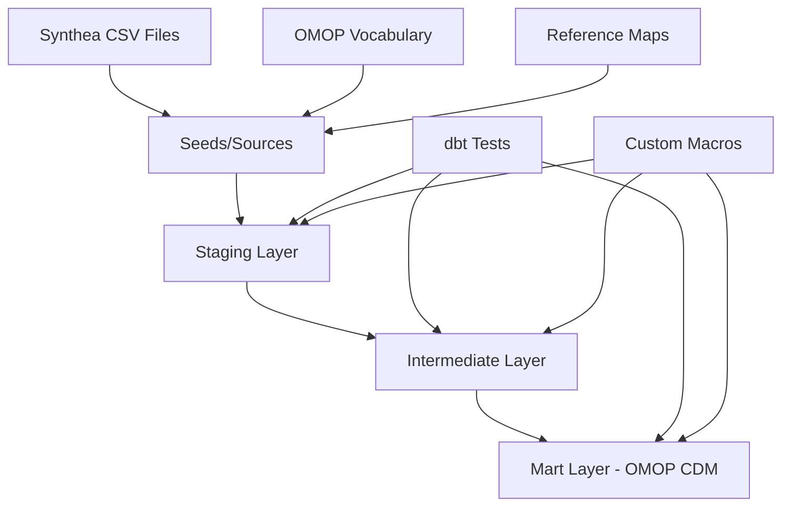

# dbt-synthea Codebase Documentation

## Table of Contents
1. [Project Overview](#project-overview)
2. [Architecture](#architecture)
3. [Directory Structure](#directory-structure)
4. [Data Flow & Transformation Pipeline](#data-flow--transformation-pipeline)
5. [Configuration](#configuration)
6. [Data Sources](#data-sources)
7. [Models](#models)
8. [Macros & Custom Functions](#macros--custom-functions)
9. [Testing Strategy](#testing-strategy)
10. [Development Setup](#development-setup)
11. [Deployment & CI/CD](#deployment--cicd)
12. [Maintenance & Operations](#maintenance--operations)
13. [Contributing](#contributing)

## Project Overview

**dbt-synthea** is a comprehensive dbt project that demonstrates the transformation of synthetic healthcare data (generated by Synthea) into the OMOP Common Data Model (CDM). This project serves as both a reference implementation and educational resource for building OMOP ETLs using modern data engineering practices.

### Key Features
- **Synthetic Data Processing**: Transforms Synthea v3.0.0 synthetic patient data into OMOP CDM format
- **Multi-Database Support**: Compatible with DuckDB and PostgreSQL
- **Modular Architecture**: Three-layer transformation pipeline (staging → intermediate → mart)
- **Comprehensive Testing**: Extensive data quality checks and referential integrity tests
- **Documentation**: Auto-generated documentation with lineage tracking
- **Code Quality**: Enforced SQL styling with SQLFluff and pre-commit hooks

### Target Audience
- **ETL Developers**: Reference for dbt-based OMOP ETL implementations
- **Analysts**: Understanding source-to-OMOP mappings and transformations
- **Software Developers**: Testing framework using synthetic OMOP data

## Architecture

The project follows a **medallion architecture** pattern with three distinct layers:



### Layer Responsibilities

1. **Staging Layer**: 1:1 mapping with source tables, type casting, column renaming
2. **Intermediate Layer**: Complex joins, business logic, reusable transformations
3. **Mart Layer**: Final OMOP CDM tables with complete schema compliance

## Directory Structure

```
dbt-synthea/
├── .github/                    # GitHub workflows and CI/CD
│   └── workflows/
│       └── generate-docs.yml   # Auto-documentation generation
├── analyses/                   # Ad-hoc analysis files
├── assets/                     # Static assets (logos, images)
├── docs/                       # Project documentation
│   └── overview.md            # Main project overview
├── macros/                     # Custom dbt macros
│   ├── create_synthea_tables.sql
│   ├── create_vocab_tables.sql
│   ├── load_data_duckdb.sql
│   ├── safe_hash.sql
│   └── macros.yml
├── models/                     # dbt models
│   ├── intermediate/           # Intermediate transformations
│   │   ├── int__person.sql
│   │   ├── int__encounters.sql
│   │   └── [other int models]
│   ├── omop/                   # Final OMOP CDM tables
│   │   ├── _models/           # Schema definitions and tests
│   │   ├── person.sql
│   │   ├── condition_occurrence.sql
│   │   └── [other OMOP tables]
│   └── staging/               # Staging layer
│       ├── map/               # Reference mappings
│       ├── synthea/           # Synthea source tables
│       └── vocabulary/        # OMOP vocabulary tables
├── requirements/              # Python dependencies
│   ├── duckdb.txt
│   └── postgres.txt
├── scripts/                   # Utility scripts
│   ├── python/               # Python utilities
│   ├── R/                    # R validation scripts
│   └── sql/                  # SQL utilities
├── seeds/                     # CSV data files
│   ├── map/                  # Reference mappings
│   ├── synthea/              # Sample Synthea data
│   └── vocabulary/           # OMOP vocabulary subset
├── dbt_project.yml           # dbt project configuration
├── packages.yml              # dbt package dependencies
└── profiles.yml              # Database connection profiles
```

## Data Flow & Transformation Pipeline

### 1. Source Data Ingestion

The project supports two data source modes controlled by the `seed_source` variable:

- **Seed Mode** (`seed_source: true`): Uses CSV files in the `seeds/` directory
- **External Mode** (`seed_source: false`): Connects to existing database tables

### 2. Staging Layer Processing

**Purpose**: Clean and standardize raw source data

**Key Models**:
- `stg_synthea__patients`: Patient demographics and identifiers
- `stg_synthea__encounters`: Healthcare encounters and visits
- `stg_synthea__conditions`: Diagnosed conditions
- `stg_synthea__medications`: Medication prescriptions
- `stg_synthea__procedures`: Medical procedures
- `stg_vocabulary__*`: OMOP vocabulary tables

**Transformations**:
- Column renaming to consistent naming conventions
- Data type casting and validation
- Basic data cleaning (trimming, case normalization)

### 3. Intermediate Layer Processing

**Purpose**: Apply business logic and create reusable transformation components

**Key Models**:
- `int__person`: Demographic mapping with concept standardization
- `int__encounters`: Visit type classification and deduplication
- `int__location`: Address hashing and location management
- `int__source_to_standard_vocab_map`: Concept mapping tables
- `int__visits`: Visit occurrence consolidation

**Business Logic Examples**:
```sql
-- Gender concept mapping in int__person
CASE
    WHEN upper(p.patient_gender) = 'M' THEN 8507  -- Male
    WHEN upper(p.patient_gender) = 'F' THEN 8532  -- Female
    ELSE 0
END AS gender_concept_id

-- Race concept mapping
CASE
    WHEN upper(p.race) = 'WHITE' THEN 8527
    WHEN upper(p.race) = 'BLACK' THEN 8516
    WHEN upper(p.race) = 'ASIAN' THEN 8515
    ELSE 0
END AS race_concept_id
```

### 4. Mart Layer (OMOP CDM)

**Purpose**: Generate final OMOP CDM-compliant tables

**OMOP Tables Generated**:
- **Person**: Patient demographics and core identifiers
- **Visit_Occurrence**: Healthcare encounters and visits
- **Condition_Occurrence**: Diagnosed conditions and diseases
- **Drug_Exposure**: Medication exposures and prescriptions
- **Procedure_Occurrence**: Medical procedures and interventions
- **Measurement**: Laboratory results and vital signs
- **Observation**: Clinical observations and assessments
- **Location**: Geographic locations and addresses
- **Provider**: Healthcare providers and practitioners
- **Care_Site**: Healthcare facilities and organizations

## Configuration

### dbt_project.yml

```yaml
name: "synthea_omop_etl"
version: "0.1.0"
profile: "synthea_omop_etl"

vars:
  seed_source: true  # Toggle between seed and external data

models:
  synthea_omop_etl:
    intermediate:
      +materialized: table
    omop:
      +materialized: table
    staging:
      +materialized: view

seeds:
  +quote_columns: true
  synthea_omop_etl:
    map:
      +schema: map_seeds
    vocabulary:
      +schema: vocab_seeds
    synthea:
      +schema: synthea_seeds
```

### profiles.yml Examples

**DuckDB Configuration**:
```yaml
synthea_omop_etl:
  outputs:
    dev:
      type: duckdb
      path: synthea_omop_etl.duckdb
      schema: dbt_synthea_dev
  target: dev
```

**PostgreSQL Configuration**:
```yaml
synthea_omop_etl:
  outputs:
    dev:
      dbname: postgres_db
      host: localhost
      user: username
      password: password
      port: 5432
      schema: dbt_synthea_dev
      threads: 4
      type: postgres
  target: dev
```

## Data Sources

### Synthea Data (Source System)

**Synthea Version**: v3.0.0 (only supported version)

**Core Tables**:
- **patients**: Patient demographics and identifiers
- **encounters**: Healthcare visits and encounters
- **conditions**: Diagnosed medical conditions
- **medications**: Prescribed medications
- **procedures**: Medical procedures and interventions
- **observations**: Clinical observations and measurements
- **allergies**: Patient allergies and intolerances
- **immunizations**: Vaccinations and immunizations
- **organizations**: Healthcare facilities
- **providers**: Healthcare practitioners

### OMOP Vocabulary (Reference Data)

**Purpose**: Standardized medical terminologies and concept mappings

**Key Tables**:
- **concept**: Standard medical concepts
- **concept_relationship**: Relationships between concepts
- **vocabulary**: Terminology systems (SNOMED, ICD-10, RxNorm, etc.)
- **domain**: Clinical domains (Condition, Drug, Procedure, etc.)
- **concept_class**: Concept classifications

### Reference Mappings

- **states.csv**: US state name to abbreviation mapping
- Custom concept mappings for Synthea-specific codes

## Models

### Staging Models

Located in `models/staging/`, these models provide clean, typed access to source data:

```sql
-- Example: stg_synthea__patients.sql
SELECT
    id AS patient_id,
    birthdate AS birth_date,
    deathdate AS death_date,
    -- ... other columns with consistent naming
FROM {{ source('synthea', 'patients') }}
```

### Intermediate Models

Located in `models/intermediate/`, these contain business logic and reusable transformations:

```sql
-- Example: int__person.sql
SELECT
    row_number() OVER (ORDER BY p.patient_id) AS person_id,
    CASE
        WHEN upper(p.patient_gender) = 'M' THEN 8507
        WHEN upper(p.patient_gender) = 'F' THEN 8532
        ELSE 0
    END AS gender_concept_id,
    -- ... additional transformations
FROM {{ ref('stg_synthea__patients') }} AS p
```

### Mart Models (OMOP Tables)

Located in `models/omop/`, these are final OMOP CDM tables:

```sql
-- Example: person.sql
SELECT
    person_id,
    gender_concept_id,
    year_of_birth,
    -- ... all OMOP person fields
FROM {{ ref('int__person') }}
```

## Macros & Custom Functions

### Core Macros

1. **safe_hash**: Generates consistent hashes for address fields
```sql
-- Usage: {{ safe_hash(['address', 'city', 'state']) }}
-- Handles NULL values gracefully
MD5(CONCAT(COALESCE(address, ''), COALESCE(city, ''), COALESCE(state, '')))
```

2. **create_synthea_tables**: Creates empty Synthea table schemas
```sql
-- Creates tables in target_schema_synthea
-- Used for external data loading
```

3. **create_vocab_tables**: Creates OMOP vocabulary table schemas
```sql
-- Creates vocabulary tables for external loading
```

4. **load_data_duckdb**: Bulk loads CSV/Parquet files into DuckDB
```sql
-- Loads files from specified directory paths
-- Supports both Synthea and vocabulary data
```

5. **Database-specific functions**:
   - `regexp_like`: Cross-database regex functionality
   - `timestamptz_to_naive`: Timestamp conversion utilities
   - `lowercase_columns`: Column name standardization

## Testing Strategy

### Test Categories

1. **Schema Tests**: Defined in YAML files
   - `not_null`: Required field validation
   - `unique`: Primary key constraints
   - `relationships`: Foreign key validation
   - `accepted_values`: Enumerated value checks

2. **Custom Tests**: SQL-based validation queries
   - Data quality checks
   - Business rule validation
   - Cross-table consistency

3. **dbt_utils Tests**: Extended testing capabilities
   - `relationships_where`: Conditional foreign keys
   - `unique_combination_of_columns`: Composite key validation

### Example Test Configuration

```yaml
# models/omop/_models/person.yml
models:
  - name: person
    columns:
      - name: person_id
        tests:
          - not_null
          - unique
      - name: gender_concept_id
        tests:
          - not_null
          - dbt_utils.relationships_where:
              to: ref('concept')
              field: concept_id
              from_condition: gender_concept_id <> 0
              to_condition: domain_id = 'Gender'
```

## Development Setup

### Prerequisites
- Python 3.12.0+
- dbt-core with database adapter (duckdb or postgres)
- VS Code with dbt Power User extension (recommended)

### Setup Process

1. **Environment Setup**:
```bash
# Clone repository
git clone https://github.com/OHDSI/dbt-synthea.git
cd dbt-synthea

# Create virtual environment
python3 -m venv dbt-env
source dbt-env/bin/activate  # Linux/Mac
# dbt-env\Scripts\activate    # Windows

# Install dependencies
pip install -r requirements/duckdb.txt  # or postgres.txt
pre-commit install
```

2. **Configuration**:
```bash
# Create profiles.yml (see Configuration section)
# Test connection
dbt debug

# Install dbt packages
dbt deps
```

3. **Data Loading**:
```bash
# Option 1: Use seed data (default)
dbt seed

# Option 2: Load external data (set seed_source: false)
# Follow BYO data instructions in README
```

4. **Build and Test**:
```bash
# Build all models and run tests
dbt build

# Or separately:
dbt run    # Build models
dbt test   # Run tests
```

### Development Workflow

1. **Feature Development**:
   - Create feature branch: `name__feature_description`
   - Make changes following style guide
   - Add tests for new models/columns
   - Update documentation

2. **Code Quality**:
   - SQLFluff linting (automatic via pre-commit)
   - Style guide compliance
   - Test coverage for new functionality

3. **Testing**:
   - Run `dbt run` and `dbt test` locally
   - Validate data quality and lineage
   - Check generated documentation

## Deployment & CI/CD

### GitHub Actions Workflow

Located in `.github/workflows/generate-docs.yml`:

```yaml
name: Generate dbt Docs
on:
  push:
    branches: [main]
jobs:
  generate-docs:
    runs-on: ubuntu-latest
    steps:
      - name: Checkout
        uses: actions/checkout@v3
      - name: Setup Python
        uses: actions/setup-python@v4
        with:
          python-version: 3.12
      - name: Install dependencies
        run: pip install -r requirements/duckdb.txt
      - name: Generate docs
        run: |
          dbt deps
          dbt seed
          dbt docs generate
      - name: Deploy to GitHub Pages
        uses: peaceiris/actions-gh-pages@v3
        with:
          github_token: ${{ secrets.GITHUB_TOKEN }}
          publish_dir: ./target
```

### Pre-commit Hooks

Configured in `.pre-commit-config.yaml`:
- SQLFluff linting and formatting
- Code quality checks
- Documentation validation

## Maintenance & Operations

### Monitoring & Observability

1. **dbt Artifacts**: 
   - `manifest.json`: Model metadata and lineage
   - `run_results.json`: Execution results and timing
   - `catalog.json`: Table and column documentation

2. **Logging**:
   - dbt logs provide detailed execution information
   - Custom logging in macros for debugging

3. **Documentation**:
   - Auto-generated docs with model lineage
   - Column-level descriptions and business context

### Performance Optimization

1. **Materialization Strategy**:
   - Staging: Views (fast, no storage overhead)
   - Intermediate: Tables (performance for complex joins)
   - Mart: Tables (final output optimization)

2. **Indexing Strategy**:
   - Primary keys on all OMOP tables
   - Foreign key relationships for join optimization

3. **Incremental Processing**:
   - Currently full-refresh model
   - Future enhancement: incremental processing for large datasets

### Data Quality Monitoring

1. **Test Coverage**:
   - Schema tests on all models
   - Business rule validation
   - Referential integrity checks

2. **Data Validation**:
   - OMOP CDM compliance validation
   - Cross-table consistency checks
   - Data completeness monitoring

## Contributing

### Code Standards

1. **SQL Style**: Follow SQLFluff configuration in `.sqlfluff`
   - Uppercase keywords
   - Leading commas
   - 4-space indentation
   - Consistent naming conventions

2. **Documentation**: 
   - Update YAML model definitions
   - Add column descriptions for clarity
   - Document business logic in comments

3. **Testing**:
   - Add tests for new models and columns
   - Maintain high test coverage
   - Validate OMOP compliance

### Pull Request Process

1. **Branch Naming**: `contributor__feature_description`
2. **Pre-submission**:
   - Run `dbt build` successfully
   - All tests passing
   - Code linting clean
   - Documentation updated

3. **Review Process**:
   - Peer code review
   - OMOP compliance validation
   - Performance impact assessment

### Community Engagement

- **OHDSI Community**: Active participation in OHDSI forums and working groups
- **Issue Tracking**: GitHub issues for bug reports and feature requests
- **Documentation**: Maintain comprehensive documentation for contributors

---

## Additional Resources

- [dbt Documentation](https://docs.getdbt.com/)
- [OMOP Common Data Model](https://www.ohdsi.org/data-standardization/)
- [Synthea Synthetic Patient Data](https://synthetichealth.github.io/synthea/)
- [OHDSI Collaborative](https://www.ohdsi.org/)
- [Project Repository](https://github.com/OHDSI/dbt-synthea)
- [OHDSI Symposium Abstract](https://www.ohdsi.org/wp-content/uploads/2024/10/124-Sadowski-dbt-synthea-Abstract-Julien-Nakache.pdf)

---

*This documentation was generated based on analysis of the dbt-synthea codebase as of the current commit. For the most up-to-date information, please refer to the project repository and generated dbt documentation.*
