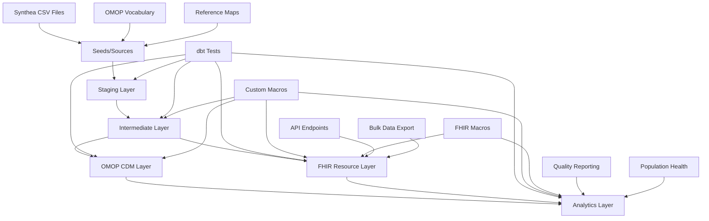
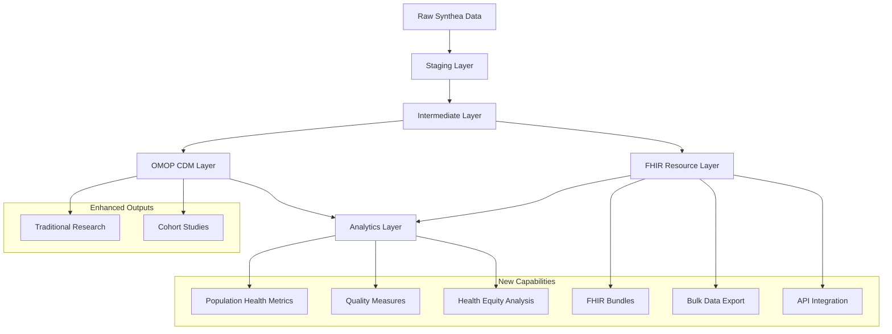

# dbt-synthea Codebase Documentation - Second Edition

## Table of Contents
1. [Project Overview](#project-overview)
2. [Enhanced Architecture](#enhanced-architecture)  
3. [Directory Structure](#directory-structure)
4. [Data Flow & Transformation Pipeline](#data-flow--transformation-pipeline)
5. [FHIR Integration](#fhir-integration)
6. [Advanced Analytics](#advanced-analytics)
7. [Configuration](#configuration)
8. [Data Sources](#data-sources)
9. [Models](#models)
10. [Macros & Custom Functions](#macros--custom-functions)
11. [Testing Strategy](#testing-strategy)
12. [FHIR Implementation Guide](#fhir-implementation-guide)
13. [Analytics Implementation Guide](#analytics-implementation-guide)
14. [API Integration & Interoperability](#api-integration--interoperability)
15. [Development Setup](#development-setup)
16. [Deployment & CI/CD](#deployment--cicd)
17. [Performance Optimization](#performance-optimization)
18. [Maintenance & Operations](#maintenance--operations)
19. [Contributing](#contributing)

## Project Overview

**dbt-synthea v2.0** represents a significant evolution of the original project, transforming from a single-purpose OMOP ETL into a comprehensive healthcare data platform that bridges traditional research analytics (OMOP CDM) with modern interoperability standards (HL7 FHIR). This enhanced version serves as both a reference implementation and a production-ready solution for healthcare data transformation and analytics.

### What's New in Version 2.0

#### 🆕 FHIR Integration Layer
- **Native FHIR R4 resource generation** from OMOP CDM data
- **US Core Implementation Guide compliance** with proper extensions
- **FHIR Bundle generation** for bulk data export and API integration
- **Cross-standard vocabulary mapping** between OMOP concepts and FHIR terminologies

#### 🆕 Advanced Analytics Platform
- **Population health metrics** with geographic and demographic stratification
- **Clinical quality measures** aligned with CMS guidelines and FHIR MeasureReport
- **Health equity analytics** with disparity identification
- **Real-time compatible JSON structures** for modern analytics tools

#### 🆕 Enhanced Interoperability
- **API-ready data formats** compatible with FHIR RESTful services
- **Bulk data export capabilities** following FHIR Bulk Data API specifications
- **Terminology service integration** with standard FHIR code systems
- **Clinical decision support** data structures for CDS Hooks integration

### Key Features

- **Multi-Standard Support**: Simultaneous OMOP CDM and FHIR resource generation
- **Advanced Analytics**: Population health, quality measures, and clinical insights
- **Modern Architecture**: JSON-native, API-ready, cloud-optimized
- **Comprehensive Testing**: Extended test coverage for FHIR resources and analytics
- **Scalable Design**: Optimized for large-scale healthcare data processing
- **Standards Compliance**: OMOP CDM v6.0, FHIR R4, US Core, CMS quality measures

### Target Audience

- **Healthcare Data Engineers**: Production-ready platform for multi-standard ETL
- **Clinical Informaticists**: FHIR-native tools for interoperability projects  
- **Population Health Analysts**: Advanced analytics with equity focus
- **Quality Measure Developers**: CMS-aligned quality reporting capabilities
- **API Developers**: FHIR-compliant data structures for application integration
- **Research Organizations**: Enhanced research capabilities with modern standards

## Enhanced Architecture

The project now follows an **enhanced medallion architecture** with four distinct layers, representing a significant evolution from the original three-layer design:



### Enhanced Layer Responsibilities

1. **Staging Layer**: 1:1 mapping with source tables, type casting, column renaming *(unchanged)*
2. **Intermediate Layer**: Complex joins, business logic, reusable transformations *(enhanced)*
3. **OMOP CDM Layer**: Traditional OMOP Common Data Model tables *(unchanged)*
4. **FHIR Resource Layer**: HL7 FHIR R4 compliant resources with JSON structures *(new)*
5. **Analytics Layer**: Advanced analytics leveraging both OMOP and FHIR data *(new)*

### Cross-Layer Integration Points

- **OMOP-to-FHIR Mapping**: Seamless transformation between standards
- **Vocabulary Harmonization**: Unified concept mapping across both models
- **Analytics Integration**: Combined insights from both OMOP and FHIR perspectives
- **API Readiness**: Direct JSON output suitable for RESTful services

## Directory Structure

```
dbt-synthea/
├── .github/                    # GitHub workflows and CI/CD
│   └── workflows/
│       ├── generate-docs.yml   # Auto-documentation generation
│       └── fhir-validation.yml # FHIR resource validation (new)
├── analyses/                   # Ad-hoc analysis files
├── assets/                     # Static assets (logos, images)
├── docs/                       # Project documentation
│   ├── overview.md            # Main project overview
│   ├── fhir-guide.md          # FHIR implementation guide (new)
│   └── analytics-guide.md     # Analytics implementation guide (new)
├── macros/                     # Custom dbt macros
│   ├── create_synthea_tables.sql
│   ├── create_vocab_tables.sql
│   ├── load_data_duckdb.sql
│   ├── safe_hash.sql
│   ├── fhir_codeable_concept.sql    # FHIR mapping macro (new)
│   ├── fhir_reference.sql           # FHIR reference macro (new)
│   ├── analytics_helpers.sql        # Analytics utility macros (new)
│   └── macros.yml
├── models/                     # dbt models
│   ├── analytics/              # Advanced analytics models (new)
│   │   ├── _models/           # Schema definitions and tests
│   │   ├── population_health_metrics.sql
│   │   ├── clinical_quality_measures.sql
│   │   ├── health_equity_analysis.sql
│   │   └── care_gap_analysis.sql
│   ├── fhir/                   # FHIR resource models (new)
│   │   ├── _models/           # Schema definitions and tests
│   │   ├── patient.sql
│   │   ├── condition.sql
│   │   ├── observation.sql
│   │   ├── medication_request.sql
│   │   ├── encounter.sql
│   │   ├── patient_bundle.sql
│   │   └── terminology/       # FHIR terminology mappings
│   │       ├── concept_map.sql
│   │       └── value_set.sql
│   ├── intermediate/           # Intermediate transformations (enhanced)
│   │   ├── int__person.sql
│   │   ├── int__encounters.sql
│   │   ├── int__fhir_patient.sql     # FHIR-specific transformations (new)
│   │   └── [other int models]
│   ├── omop/                   # Final OMOP CDM tables (unchanged)
│   │   ├── _models/           # Schema definitions and tests
│   │   ├── person.sql
│   │   ├── condition_occurrence.sql
│   │   └── [other OMOP tables]
│   └── staging/               # Staging layer (unchanged)
│       ├── map/               # Reference mappings
│       ├── synthea/           # Synthea source tables
│       └── vocabulary/        # OMOP vocabulary tables
├── requirements/              # Python dependencies
│   ├── duckdb.txt
│   ├── postgres.txt
│   └── fhir.txt               # FHIR-specific dependencies (new)
├── scripts/                   # Utility scripts
│   ├── python/               # Python utilities
│   │   ├── fhir_validator.py  # FHIR resource validation (new)
│   │   └── bulk_export.py     # FHIR bulk data export (new)
│   ├── R/                    # R validation scripts
│   └── sql/                  # SQL utilities
├── tests/                     # Enhanced testing framework
│   ├── fhir/                 # FHIR-specific tests (new)
│   ├── analytics/            # Analytics tests (new)
│   └── integration/          # Cross-layer integration tests (new)
├── dbt_project.yml           # Enhanced dbt project configuration
├── packages.yml              # dbt package dependencies
└── profiles.yml              # Database connection profiles
```

## Data Flow & Transformation Pipeline

### Enhanced Pipeline Overview

The enhanced pipeline now supports multiple output formats and analytical perspectives:



### 1. Enhanced Intermediate Layer Processing

The intermediate layer now includes FHIR-specific transformations alongside traditional OMOP processing:

#### Key Enhancements:
- **Dual-format preparation**: Data structured for both OMOP and FHIR outputs
- **JSON preprocessing**: Native JSON structure preparation for FHIR resources
- **Enhanced vocabulary mapping**: Cross-standard concept harmonization
- **Extension handling**: US Core and other FHIR extension preparation

#### Example Enhanced Transformation:
```sql
-- Enhanced int__person.sql with FHIR preparation
WITH person_base AS (
    SELECT 
        -- Traditional OMOP fields
        person_id,
        gender_concept_id,
        year_of_birth,
        -- FHIR-specific preparations
        JSON_OBJECT(
            'use', 'usual',
            'system', 'urn:synthea:patient',
            'value', person_source_value
        ) as fhir_identifier,
        -- US Core extensions
        CASE race_concept_id
            WHEN 8527 THEN '2106-3'  -- White
            WHEN 8516 THEN '2054-5'  -- Black
            WHEN 8515 THEN '2028-9'  -- Asian
        END as omb_race_code
    FROM staged_patients
)
```

### 2. FHIR Resource Generation

#### FHIR Resource Pipeline:
```sql
-- FHIR Patient resource generation
SELECT
    'Patient' AS resourceType,
    CAST(person_id AS VARCHAR) AS id,
    fhir_identifier AS identifier,
    CASE gender_concept_id
        WHEN 8507 THEN 'male'
        WHEN 8532 THEN 'female'
    END AS gender,
    -- US Core race extension
    JSON_ARRAY(
        JSON_OBJECT(
            'url', 'http://hl7.org/fhir/us/core/StructureDefinition/us-core-race',
            'extension', race_extension_array
        )
    ) AS extension
FROM enhanced_person_intermediate
```

### 3. Advanced Analytics Pipeline

#### Population Health Analytics:
```sql
-- Multi-dimensional population analysis
WITH demographic_stratification AS (
    SELECT 
        geographic_region,
        age_group,
        gender,
        race_ethnicity,
        COUNT(*) as population_size,
        -- Extract conditions from FHIR resources
        COUNT(CASE WHEN has_chronic_condition THEN 1 END) as chronic_disease_count
    FROM analytics_base_population
    GROUP BY 1,2,3,4
)
```

## FHIR Integration

### FHIR Implementation Overview

The FHIR integration provides comprehensive support for HL7 FHIR R4 with focus on US Core Implementation Guide compliance.

#### Supported FHIR Resources

| Resource | Status | US Core | Key Features |
|----------|--------|---------|-------------|
| Patient | ✅ Complete | ✅ Yes | Demographics, identifiers, extensions |
| Condition | ✅ Complete | ✅ Yes | Clinical status, verification, coding |
| Observation | 🔄 In Progress | ✅ Yes | Vital signs, lab results, assessments |
| Encounter | 📋 Planned | ✅ Yes | Healthcare encounters, visit details |
| MedicationRequest | 📋 Planned | ✅ Yes | Medication prescriptions, orders |
| Procedure | 📋 Planned | ✅ Yes | Medical procedures, interventions |
| Bundle | ✅ Complete | ✅ Yes | Resource collections, bulk export |

### FHIR Resource Structure

#### Patient Resource Example:
```json
{
  "resourceType": "Patient",
  "id": "12345",
  "identifier": [
    {
      "use": "usual",
      "system": "urn:synthea:patient", 
      "value": "patient-uuid"
    }
  ],
  "active": true,
  "gender": "male",
  "birthDate": "1990-05-15",
  "address": [
    {
      "use": "home",
      "line": ["123 Main St"],
      "city": "Boston",
      "state": "MA",
      "postalCode": "02101",
      "country": "US"
    }
  ],
  "extension": [
    {
      "url": "http://hl7.org/fhir/us/core/StructureDefinition/us-core-race",
      "extension": [
        {
          "url": "ombCategory",
          "valueCoding": {
            "system": "urn:oid:2.16.840.1.113883.6.238",
            "code": "2106-3",
            "display": "White"
          }
        }
      ]
    }
  ]
}
```

### FHIR Vocabulary Mapping

#### OMOP to FHIR Code System Mapping:
```sql
-- fhir_codeable_concept macro implementation
CASE vocabulary_id
    WHEN 'SNOMED' THEN 'http://snomed.info/sct'
    WHEN 'LOINC' THEN 'http://loinc.org'  
    WHEN 'ICD10CM' THEN 'http://hl7.org/fhir/sid/icd-10-cm'
    WHEN 'RxNorm' THEN 'http://www.nlm.nih.gov/research/umls/rxnorm'
    WHEN 'CPT4' THEN 'http://www.ama-assn.org/go/cpt'
    WHEN 'UCUM' THEN 'http://unitsofmeasure.org'
END as fhir_system
```

### FHIR Bundle Generation

FHIR Bundles aggregate multiple resources for efficient data exchange:

```sql
-- Patient Bundle with all related resources
SELECT
  'Bundle' AS resourceType,
  'collection' AS type,
  JSON_OBJECT(
    'total', resource_count,
    'lastUpdated', CURRENT_TIMESTAMP
  ) AS meta,
  JSON_ARRAYAGG(
    JSON_OBJECT(
      'fullUrl', resource_url,
      'resource', resource_json
    )
  ) AS entry
FROM patient_related_resources
```

## Advanced Analytics

### Population Health Analytics

#### Geographic Health Disparities:
```sql
-- Geographic disparity analysis with statistical significance
WITH regional_metrics AS (
    SELECT 
        state,
        county,
        COUNT(*) as population,
        AVG(chronic_disease_rate) as avg_chronic_rate,
        STDDEV(chronic_disease_rate) as stddev_chronic_rate
    FROM population_health_base
    GROUP BY state, county
),
disparity_analysis AS (
    SELECT *,
        CASE WHEN avg_chronic_rate > 
            (national_avg + 2 * national_stddev) 
        THEN 'Significant Disparity'
        ELSE 'Within Normal Range'
        END as disparity_status
    FROM regional_metrics
)
```

#### Social Determinants Integration:
```sql
-- FHIR Observation resources for SDOH
SELECT
    'Observation' as resourceType,
    JSON_OBJECT(
        'coding', JSON_ARRAY(
            JSON_OBJECT(
                'system', 'http://loinc.org',
                'code', '76437-3',  -- Primary insurance
                'display', 'Primary insurance'
            )
        )
    ) as code,
    insurance_status as valueString
FROM patient_sdoh_data
```

### Clinical Quality Measures

#### CMS Quality Measure Implementation:
```sql
-- CMS122v11: Diabetes HbA1c Poor Control
WITH measure_populations AS (
    SELECT
        'initial-population' as population_type,
        COUNT(DISTINCT patient_id) as count
    FROM diabetes_patients_18_75
    
    UNION ALL
    
    SELECT  
        'denominator' as population_type,
        COUNT(DISTINCT patient_id) as count
    FROM diabetes_patients_eligible
    
    UNION ALL
    
    SELECT
        'numerator' as population_type, 
        COUNT(DISTINCT patient_id) as count
    FROM diabetes_poor_control_hba1c
)

-- Generate FHIR MeasureReport
SELECT
    'MeasureReport' as resourceType,
    'summary' as type,
    'complete' as status,
    JSON_OBJECT(
        'reference', 'Measure/CMS122v11'
    ) as measure,
    JSON_ARRAYAGG(
        JSON_OBJECT(
            'code', JSON_OBJECT(
                'coding', JSON_ARRAY(
                    JSON_OBJECT(
                        'system', 'http://terminology.hl7.org/CodeSystem/measure-population',
                        'code', population_type
                    )
                )
            ),
            'count', count
        )
    ) as group
FROM measure_populations
```

### Health Equity Analytics

#### Stratified Outcomes Analysis:
```sql
-- Multi-dimensional health equity analysis
SELECT
    race_ethnicity,
    socioeconomic_status,
    geographic_region,
    clinical_outcome,
    COUNT(*) as patient_count,
    AVG(outcome_score) as avg_outcome,
    -- Calculate equity metrics
    (AVG(outcome_score) - overall_avg) / overall_stddev as equity_z_score,
    CASE WHEN ABS(equity_z_score) > 2 
        THEN 'Significant Disparity'
        ELSE 'Within Expected Range'
    END as equity_status
FROM stratified_outcomes_base
CROSS JOIN overall_statistics  
GROUP BY 1,2,3,4
```

## Configuration

### Enhanced dbt_project.yml

```yaml
name: "synthea_omop_etl"
version: "2.0.0"
config-version: 2

profile: "synthea_omop_etl"

vars:
  seed_source: true
  fhir_enabled: true           # Enable FHIR resource generation
  analytics_enabled: true     # Enable advanced analytics
  bulk_export_enabled: true   # Enable bulk data export capabilities

models:
  synthea_omop_etl:
    intermediate:
      +materialized: table
      +docs:
        node_color: '#FBC511'
    omop:
      +materialized: table  
      +docs:
        node_color: '#EB6622'
    fhir:                      # New FHIR resource layer
      +materialized: table
      +indexes:
        - columns: ['id']
          unique: true
      +docs:
        node_color: '#28A745'
    analytics:                 # New analytics layer
      +materialized: table
      +docs:
        node_color: '#FF6B35'
    staging:
      synthea:
        +materialized: view
        +docs:
          node_color: '#336B91'
      vocabulary:
        +materialized: view
        +docs:
          node_color: '#336B91'
      map:
        +materialized: view
        +docs:
          node_color: '#336B91'

# FHIR-specific configurations
on-run-start:
  - "{{ validate_fhir_resources() }}"   # Custom macro for FHIR validation

on-run-end:
  - "{{ generate_fhir_capability_statement() }}"  # Generate FHIR metadata
```

### Enhanced Database Profiles

#### DuckDB with JSON Extensions:
```yaml
synthea_omop_etl:
  outputs:
    dev:
      type: duckdb
      path: synthea_omop_etl.duckdb
      schema: dbt_synthea_dev
      extensions:
        - json                 # Enable JSON functions for FHIR
        - httpfs              # Enable HTTP access for terminology
  target: dev
```

#### PostgreSQL with JSONB Optimization:
```yaml
synthea_omop_etl:
  outputs:
    production:
      type: postgres
      host: postgres.healthcare.local
      port: 5432
      user: synthea_user
      password: "{{ env_var('DB_PASSWORD') }}"
      dbname: synthea_omop
      schema: synthea_prod
      search_path: synthea_prod,fhir_resources,analytics
      # PostgreSQL-specific optimizations for JSON
      connect_timeout: 60
      application_name: dbt_synthea_v2
  target: production
```

## Models

### Enhanced Model Categories

#### 1. Staging Models *(unchanged but enhanced)*
Foundation layer with improved type safety and FHIR preparation:

```sql
-- Enhanced stg_synthea__patients.sql
WITH patients_typed AS (
    SELECT
        id::VARCHAR as patient_id,
        birthdate::DATE as birth_date,
        -- Enhanced type casting for FHIR compatibility
        CASE WHEN deathdate != '' THEN deathdate::DATE END as death_date,
        -- JSON preprocessing for complex fields
        JSON_OBJECT('street', address, 'city', city, 'state', state) as address_json
    FROM {{ source('synthea', 'patients') }}
)
```

#### 2. Intermediate Models *(significantly enhanced)*
Business logic layer now supports both OMOP and FHIR transformations:

```sql
-- int__fhir_patient.sql (new)
WITH fhir_patient_prep AS (
    SELECT
        person_id,
        -- FHIR-specific identifier preparation
        JSON_ARRAY(
            JSON_OBJECT(
                'use', 'usual',
                'system', 'urn:synthea:patient',
                'value', person_source_value
            )
        ) as fhir_identifiers,
        
        -- US Core extension preparation
        CASE 
            WHEN race_concept_id = 8527 THEN 
                JSON_OBJECT(
                    'url', 'http://hl7.org/fhir/us/core/StructureDefinition/us-core-race',
                    'extension', JSON_ARRAY(
                        JSON_OBJECT(
                            'url', 'ombCategory',
                            'valueCoding', JSON_OBJECT(
                                'system', 'urn:oid:2.16.840.1.113883.6.238',
                                'code', '2106-3',
                                'display', 'White'
                            )
                        )
                    )
                )
        END as race_extension
    FROM {{ ref('int__person') }}
)
```

#### 3. OMOP CDM Models *(unchanged)*
Traditional OMOP Common Data Model implementation remains fully functional.

#### 4. FHIR Resource Models *(new)*
Native FHIR R4 resource generation with full compliance:

```sql
-- models/fhir/condition.sql
SELECT
    'Condition' AS resourceType,
    CAST(condition_occurrence_id AS VARCHAR) AS id,
    
    -- FHIR-compliant clinical status
    JSON_OBJECT(
        'coding', JSON_ARRAY(
            JSON_OBJECT(
                'system', 'http://terminology.hl7.org/CodeSystem/condition-clinical',
                'code', CASE 
                    WHEN condition_end_date IS NULL THEN 'active'
                    ELSE 'resolved' 
                END
            )
        )
    ) AS clinicalStatus,
    
    -- OMOP-to-FHIR concept mapping
    {{ fhir_codeable_concept(
        'condition_concept_id',
        'c.concept_code',
        'c.concept_name', 
        'c.vocabulary_id',
        'condition_source_value'
    ) }} AS code
    
FROM {{ ref('condition_occurrence') }} co
JOIN {{ ref('concept') }} c ON co.condition_concept_id = c.concept_id
```

#### 5. Analytics Models *(new)*
Advanced analytics leveraging both OMOP and FHIR data:

```sql
-- models/analytics/population_health_metrics.sql
WITH fhir_demographics AS (
    SELECT
        CAST(id AS INTEGER) as person_id,
        gender,
        -- Extract race from FHIR extensions
        JSON_EXTRACT_SCALAR(
            extension[0], 
            '$.extension[0].valueCoding.display'
        ) as race_display,
        -- Geographic extraction
        JSON_EXTRACT_SCALAR(address[0], '$.state') as state
    FROM {{ ref('patient') }}
),

condition_prevalence AS (
    SELECT
        person_id,
        -- Extract condition codes from FHIR resources
        JSON_EXTRACT_SCALAR(code, '$.coding[0].code') as condition_code,
        JSON_EXTRACT_SCALAR(code, '$.coding[0].display') as condition_display
    FROM {{ ref('condition') }}
    WHERE JSON_EXTRACT_SCALAR(clinicalStatus, '$.coding[0].code') = 'active'
)

SELECT
    fd.state,
    fd.race_display,
    COUNT(DISTINCT fd.person_id) as total_population,
    COUNT(DISTINCT cp.person_id) as condition_population,
    ROUND(
        COUNT(DISTINCT cp.person_id) * 100.0 / COUNT(DISTINCT fd.person_id), 
        2
    ) as prevalence_rate
FROM fhir_demographics fd
LEFT JOIN condition_prevalence cp ON fd.person_id = cp.person_id
WHERE cp.condition_code IN ('73211009', '38341003')  -- Diabetes, Hypertension
GROUP BY 1, 2
```

## Macros & Custom Functions

### Enhanced Macro Library

#### 1. FHIR-Specific Macros

##### fhir_codeable_concept Macro:
```sql

JSON_OBJECT(
  'coding', JSON_ARRAY(
    JSON_OBJECT(
      'system', CASE {{ vocabulary_id_col }}
        WHEN 'SNOMED' THEN 'http://snomed.info/sct'
        WHEN 'LOINC' THEN 'http://loinc.org'
        WHEN 'ICD10CM' THEN 'http://hl7.org/fhir/sid/icd-10-cm'
        WHEN 'RxNorm' THEN 'http://www.nlm.nih.gov/research/umls/rxnorm'
        WHEN 'CPT4' THEN 'http://www.ama-assn.org/go/cpt'
        WHEN 'UCUM' THEN 'http://unitsofmeasure.org'
        ELSE 'http://terminology.hl7.org/CodeSystem/omop-vocabulary'
      END,
      'code', {{ concept_code_col }},
      'display', {{ concept_name_col }}
    )
  )
  
  , 'text', {{ source_value_col }}
  
)

```

##### fhir_reference Macro:
```sql

JSON_OBJECT(
  'reference', '{{ resource_type }}/' || CAST({{ resource_id_col }} AS VARCHAR)
)

```

##### us_core_race_extension Macro:
```sql

JSON_OBJECT(
  'url', 'http://hl7.org/fhir/us/core/StructureDefinition/us-core-race',
  'extension', JSON_ARRAY(
    JSON_OBJECT(
      'url', 'ombCategory',
      'valueCoding', JSON_OBJECT(
        'system', 'urn:oid:2.16.840.1.113883.6.238',
        'code', CASE {{ race_concept_id_col }}
          WHEN 8527 THEN '2106-3'  -- White
          WHEN 8516 THEN '2054-5'  -- Black or African American  
          WHEN 8515 THEN '2028-9'  -- Asian
          WHEN 8657 THEN '1002-5'  -- American Indian or Alaska Native
          WHEN 8557 THEN '2076-8'  -- Native Hawaiian or Other Pacific Islander
          ELSE 'UNK'               -- Unknown
        END,
        'display', {{ race_source_value_col }}
      )
    ),
    JSON_OBJECT(
      'url', 'text',
      'valueString', {{ race_source_value_col }}
    )
  )
)

```

#### 2. Analytics Helper Macros

##### stratify_population Macro:
```sql

WITH stratified AS (
  SELECT *,
    CASE 
      WHEN {{ age_col }} < 18 THEN 'Pediatric'
      WHEN {{ age_col }} BETWEEN 18 AND 64 THEN 'Adult' 
      ELSE 'Senior'
    END as age_group
    
    , CASE
        WHEN {{ income_col }} < 25000 THEN 'Low Income'
        WHEN {{ income_col }} BETWEEN 25000 AND 75000 THEN 'Middle Income'
        ELSE 'High Income'
      END as income_group
    
    
    , CASE
        WHEN {{ education_col }} IN ('Less than high school', 'High school') THEN 'High School or Less'
        WHEN {{ education_col }} IN ('Some college', 'College') THEN 'College'
        ELSE 'Graduate'
      END as education_group  
    
  FROM base_population
)
SELECT * FROM stratified

```

##### calculate_health_equity_metrics Macro:
```sql

WITH equity_base AS (
  SELECT 
    
    {{ col }},
    
    {{ outcome_col }} as outcome_value,
    AVG({{ outcome_col }}) OVER () as overall_avg,
    STDDEV({{ outcome_col }}) OVER () as overall_stddev
  FROM population_with_outcomes
),

equity_metrics AS (
  SELECT 
    
    {{ col }},
    
    COUNT(*) as group_size,
    AVG(outcome_value) as group_avg,
    STDDEV(outcome_value) as group_stddev,
    -- Calculate disparity metrics
    (AVG(outcome_value) - MAX(overall_avg)) / MAX(overall_stddev) as z_score,
    CASE 
      WHEN ABS((AVG(outcome_value) - MAX(overall_avg)) / MAX(overall_stddev)) > 2 
      THEN 'Significant Disparity'
      WHEN ABS((AVG(outcome_value) - MAX(overall_avg)) / MAX(overall_stddev)) > 1
      THEN 'Moderate Disparity'  
      ELSE 'Within Expected Range'
    END as disparity_level
  FROM equity_base
  GROUP BY {{ col }}{{ "," if not loop.last }}
)

SELECT * FROM equity_metrics

```

#### 3. Validation and Quality Macros

##### validate_fhir_resource Macro:
```sql

  
  SELECT 
    '{{ resource_type }}' as resource_type,
    COUNT(*) as total_resources,
    COUNT(CASE WHEN id IS NULL THEN 1 END) as missing_ids,
    COUNT(CASE WHEN resourceType != '{{ resource_type }}' THEN 1 END) as incorrect_type,
    -- Resource-specific validations
    
    COUNT(CASE WHEN gender NOT IN ('male', 'female', 'other', 'unknown') THEN 1 END) as invalid_gender,
    COUNT(CASE WHEN JSON_ARRAY_LENGTH(identifier) = 0 THEN 1 END) as missing_identifiers
      
    COUNT(CASE WHEN JSON_EXTRACT_SCALAR(clinicalStatus, '$.coding[0].code') NOT IN ('active', 'resolved', 'inactive') THEN 1 END) as invalid_clinical_status
    
  FROM {{ ref(resource_table) }}
  
  
  {{ return(validation_query) }}

```

##### generate_fhir_capability_statement Macro:
```sql

  
  
  INSERT INTO fhir_capability_statement (
    resourceType,
    status,
    date,
    name,
    rest
  )
  VALUES (
    'CapabilityStatement',
    'active', 
    CURRENT_DATE,
    'dbt-synthea FHIR Server',
    JSON_OBJECT(
      'mode', 'server',
      'resource', JSON_ARRAY(
        
        JSON_OBJECT(
          'type', '{{ resource }}',
          'interaction', JSON_ARRAY(
            JSON_OBJECT('code', 'read'),
            JSON_OBJECT('code', 'search-type')
          ),
          'searchParam', JSON_ARRAY(
            JSON_OBJECT('name', '_id', 'type', 'token')
          )
        ){{ "," if not loop.last }}
        
      )
    )
  )

```

## Testing Strategy

### Enhanced Testing Framework

#### 1. Traditional dbt Tests *(enhanced)*
Extended schema tests with FHIR-specific validations:

```yaml
# models/fhir/_models/patient.yml
models:
  - name: patient
    description: FHIR R4 Patient resource
    tests:
      - dbt_utils.unique_combination_of_columns:
          combination_of_columns:
            - id
            - resourceType
    columns:
      - name: id
        description: Patient identifier
        tests:
          - not_null
          - unique
      - name: resourceType  
        description: FHIR resource type
        tests:
          - not_null
          - accepted_values:
              values: ['Patient']
      - name: gender
        description: Patient gender
        tests:
          - accepted_values:
              values: ['male', 'female', 'other', 'unknown']
      - name: identifier
        description: Patient identifiers
        tests:
          - not_null
          - fhir_identifier_validation  # Custom test
```

#### 2. FHIR-Specific Tests *(new)*

##### Custom FHIR Validation Tests:

```sql
-- tests/fhir/test_fhir_identifier_validation.sql


WITH identifier_validation AS (
    SELECT 
        {{ column_name }},
        -- Check if identifier is valid JSON array
        CASE 
            WHEN JSON_VALID({{ column_name }}) 
            AND JSON_TYPE({{ column_name }}) = 'array'
            AND JSON_ARRAY_LENGTH({{ column_name }}) > 0
            THEN 0
            ELSE 1
        END as is_invalid
    FROM {{ model }}
    WHERE {{ column_name }} IS NOT NULL
)

SELECT *
FROM identifier_validation  
WHERE is_invalid = 1


```

##### FHIR CodeableConcept Validation:
```sql
-- tests/fhir/test_codeable_concept_validation.sql


WITH codeable_concept_validation AS (
    SELECT 
        {{ column_name }},
        -- Validate CodeableConcept structure
        CASE 
            WHEN JSON_VALID({{ column_name }})
            AND JSON_EXTRACT_SCALAR({{ column_name }}, '$.coding') IS NOT NULL
            AND JSON_ARRAY_LENGTH(JSON_EXTRACT({{ column_name }}, '$.coding')) > 0
            THEN 0
            ELSE 1  
        END as is_invalid
    FROM {{ model }}
    WHERE {{ column_name }} IS NOT NULL
)

SELECT *
FROM codeable_concept_validation
WHERE is_invalid = 1


```

#### 3. Analytics Tests *(new)*

##### Population Health Metrics Validation:
```sql
-- tests/analytics/test_population_health_completeness.sql
WITH completeness_check AS (
    SELECT
        geographic_region,
        COUNT(*) as total_records,
        COUNT(CASE WHEN total_patients IS NULL THEN 1 END) as missing_population,
        COUNT(CASE WHEN chronic_disease_rate IS NULL THEN 1 END) as missing_rates,
        COUNT(CASE WHEN chronic_disease_rate < 0 OR chronic_disease_rate > 100 THEN 1 END) as invalid_rates
    FROM {{ ref('population_health_metrics') }}
    GROUP BY geographic_region
)

SELECT *
FROM completeness_check
WHERE missing_population > 0 
   OR missing_rates > 0
   OR invalid_rates > 0
```

##### Quality Measures Validation:
```sql
-- tests/analytics/test_quality_measures_logic.sql  
WITH measure_validation AS (
    SELECT
        measure_id,
        numerator,
        denominator,
        performance_rate,
        -- Validate measure logic
        CASE 
            WHEN numerator > denominator THEN 'Numerator exceeds denominator'
            WHEN performance_rate != ROUND((numerator * 100.0 / denominator), 2) THEN 'Incorrect rate calculation'
            WHEN denominator = 0 AND performance_rate IS NOT NULL THEN 'Rate calculated with zero denominator'
            ELSE 'Valid'
        END as validation_status
    FROM {{ ref('clinical_quality_measures') }}
)

SELECT *
FROM measure_validation
WHERE validation_status != 'Valid'
```

#### 4. Integration Tests *(new)*

##### Cross-Standard Consistency Tests:
```sql
-- tests/integration/test_omop_fhir_consistency.sql
WITH patient_consistency AS (
    SELECT 
        o.person_id,
        f.id as fhir_id,
        -- Check gender consistency
        CASE 
            WHEN (o.gender_concept_id = 8507 AND f.gender = 'male') OR
                 (o.gender_concept_id = 8532 AND f.gender = 'female')
            THEN 'Consistent'
            ELSE 'Inconsistent'
        END as gender_consistency,
        -- Check birth date consistency  
        CASE
            WHEN o.year_of_birth = EXTRACT(YEAR FROM f.birthDate::DATE)
            THEN 'Consistent'
            ELSE 'Inconsistent' 
        END as birth_date_consistency
    FROM {{ ref('person') }} o
    JOIN {{ ref('patient') }} f ON CAST(o.person_id AS VARCHAR) = f.id
)

SELECT *
FROM patient_consistency
WHERE gender_consistency = 'Inconsistent' 
   OR birth_date_consistency = 'Inconsistent'
```

##### Data Quality Metrics Test:
```sql
-- tests/integration/test_data_quality_metrics.sql
WITH quality_metrics AS (
    SELECT 
        'OMOP Person' as table_name,
        COUNT(*) as total_records,
        COUNT(CASE WHEN person_id IS NULL THEN 1 END) as null_primary_keys,
        COUNT(CASE WHEN gender_concept_id = 0 THEN 1 END) as unmapped_concepts,
        ROUND(
            (COUNT(*) - COUNT(CASE WHEN person_id IS NULL THEN 1 END)) * 100.0 / COUNT(*), 
            2
        ) as completeness_rate
    FROM {{ ref('person') }}
    
    UNION ALL
    
    SELECT 
        'FHIR Patient' as table_name,
        COUNT(*) as total_records, 
        COUNT(CASE WHEN id IS NULL THEN 1 END) as null_primary_keys,
        COUNT(CASE WHEN gender = 'unknown' THEN 1 END) as unmapped_concepts,
        ROUND(
            (COUNT(*) - COUNT(CASE WHEN id IS NULL THEN 1 END)) * 100.0 / COUNT(*),
            2  
        ) as completeness_rate
    FROM {{ ref('patient') }}
)

SELECT *
FROM quality_metrics
WHERE completeness_rate < 95  -- Minimum acceptable completeness
   OR null_primary_keys > 0
```

## FHIR Implementation Guide

### Getting Started with FHIR Resources

#### 1. Enable FHIR in Your Project

Update your `dbt_project.yml`:
```yaml
vars:
  fhir_enabled: true
  fhir_version: "R4"
  us_core_enabled: true
```

#### 2. Run FHIR Resource Generation

```bash
# Generate FHIR resources alongside OMOP
dbt run --select fhir

# Generate specific FHIR resource
dbt run --select fhir.patient

# Test FHIR resource validity
dbt test --select fhir
```

#### 3. FHIR Resource Customization

##### Custom Extensions:
```sql
-- Add custom extensions to Patient resource
SELECT
  *,
  -- Add custom organization extension
  JSON_ARRAY_APPEND(
    extension,
    JSON_OBJECT(
      'url', 'http://example.org/fhir/StructureDefinition/patient-organization',
      'valueReference', JSON_OBJECT(
        'reference', 'Organization/' || organization_id
      )
    )
  ) as extension
FROM base_patient_resource
```

##### Custom Search Parameters:
```sql
-- Generate search parameter resources
SELECT
  'SearchParameter' as resourceType,
  'patient-ssn' as id,
  'Patient' as base,
  'identifier' as code,
  'token' as type,
  'urn:synthea:ssn' as target_system
```

### FHIR API Integration

#### 1. Bulk Data Export

The patient bundle model generates FHIR-compliant bulk data:

```sql
-- Export all patients with conditions
SELECT 
  resourceType,
  id,
  TO_JSON(*) as resource_json
FROM {{ ref('patient_bundle') }}
WHERE JSON_ARRAY_LENGTH(entry) > 1  -- Patients with related data
```

#### 2. FHIR Server Integration

##### REST API Endpoints:
```sql
-- Generate endpoint metadata
WITH fhir_endpoints AS (
  SELECT 
    'Patient' as resource_type,
    '/fhir/Patient' as endpoint,
    JSON_ARRAY('GET', 'POST') as supported_methods,
    JSON_ARRAY('_id', '_identifier', 'gender', 'birthdate') as search_params
  
  UNION ALL
  
  SELECT
    'Condition' as resource_type, 
    '/fhir/Condition' as endpoint,
    JSON_ARRAY('GET') as supported_methods,
    JSON_ARRAY('_id', 'patient', 'code', 'clinical-status') as search_params
)

SELECT * FROM fhir_endpoints
```

##### Capability Statement Generation:
```sql
-- Generate FHIR CapabilityStatement
SELECT
  'CapabilityStatement' as resourceType,
  'dbt-synthea-server' as id,
  'active' as status,
  CURRENT_TIMESTAMP as date,
  'dbt-synthea FHIR Server' as name,
  JSON_OBJECT(
    'mode', 'server',
    'fhirVersion', '4.0.1',
    'format', JSON_ARRAY('json'),
    'resource', (
      SELECT JSON_ARRAYAGG(
        JSON_OBJECT(
          'type', resource_type,
          'profile', 'http://hl7.org/fhir/us/core/StructureDefinition/us-core-' || LOWER(resource_type),
          'interaction', JSON_ARRAY(
            JSON_OBJECT('code', 'read'),
            JSON_OBJECT('code', 'search-type')
          )
        )
      )
      FROM supported_resources
    )
  ) as rest
```

### FHIR Validation and Compliance

#### 1. Resource Validation

```sql
-- FHIR resource validation query
WITH validation_results AS (
  SELECT
    id,
    resourceType,
    -- Required element validation
    CASE WHEN id IS NULL THEN 'Missing required id' END as id_validation,
    CASE WHEN resourceType != 'Patient' THEN 'Incorrect resourceType' END as type_validation,
    -- Business rule validation
    CASE WHEN gender NOT IN ('male', 'female', 'other', 'unknown') 
         THEN 'Invalid gender value' END as gender_validation,
    -- Extension validation
    CASE WHEN JSON_VALID(extension) = 0 THEN 'Invalid extension JSON' END as extension_validation
  FROM {{ ref('patient') }}
)

SELECT *
FROM validation_results
WHERE COALESCE(id_validation, type_validation, gender_validation, extension_validation) IS NOT NULL
```

#### 2. US Core Profile Compliance

```sql
-- US Core Patient profile validation
WITH us_core_validation AS (
  SELECT 
    id,
    -- Must Support elements for US Core Patient
    CASE WHEN JSON_ARRAY_LENGTH(identifier) = 0 
         THEN 'Missing required identifier' END as identifier_check,
    CASE WHEN gender IS NULL 
         THEN 'Missing required gender' END as gender_check,
    CASE WHEN JSON_EXTRACT(extension[0], '$.url') != 'http://hl7.org/fhir/us/core/StructureDefinition/us-core-race'
         THEN 'Missing required US Core race extension' END as race_extension_check
  FROM {{ ref('patient') }}
)

SELECT *
FROM us_core_validation  
WHERE COALESCE(identifier_check, gender_check, race_extension_check) IS NOT NULL
```

## Analytics Implementation Guide

### Population Health Analytics

#### 1. Setting Up Population Health Metrics

```sql
-- Base population health analysis
WITH population_base AS (
  SELECT 
    p.id as patient_id,
    -- Extract demographics from FHIR Patient
    p.gender,
    EXTRACT(YEAR FROM CURRENT_DATE) - EXTRACT(YEAR FROM p.birthDate::DATE) as current_age,
    JSON_EXTRACT_SCALAR(p.address[0], '$.state') as state,
    JSON_EXTRACT_SCALAR(p.address[0], '$.city') as city,
    -- Extract race from US Core extension
    JSON_EXTRACT_SCALAR(
      p.extension[0], 
      '$.extension[0].valueCoding.display'
    ) as race
  FROM {{ ref('patient') }} p
),

health_conditions AS (
  SELECT 
    CAST(REGEXP_REPLACE(c.subject->>'$.reference', 'Patient/', '') AS INTEGER) as patient_id,
    JSON_EXTRACT_SCALAR(c.code, '$.coding[0].code') as condition_code,
    JSON_EXTRACT_SCALAR(c.code, '$.coding[0].display') as condition_name,
    c.onsetDateTime::DATE as onset_date
  FROM {{ ref('condition') }} c
  WHERE JSON_EXTRACT_SCALAR(c.clinicalStatus, '$.coding[0].code') = 'active'
)

SELECT 
  pb.state,
  pb.city,
  pb.race,
  pb.gender,
  COUNT(DISTINCT pb.patient_id) as total_population,
  -- Chronic disease metrics
  COUNT(DISTINCT CASE 
    WHEN hc.condition_code IN ('73211009', '38341003', '195967001') -- Diabetes, HTN, Asthma
    THEN pb.patient_id 
  END) as chronic_disease_patients,
  -- Calculate prevalence rates
  ROUND(
    COUNT(DISTINCT CASE 
      WHEN hc.condition_code IN ('73211009', '38341003', '195967001')
      THEN pb.patient_id 
    END) * 100.0 / COUNT(DISTINCT pb.patient_id),
    2
  ) as chronic_disease_prevalence_rate
FROM population_base pb
LEFT JOIN health_conditions hc ON pb.patient_id = hc.patient_id
GROUP BY 1,2,3,4
HAVING COUNT(DISTINCT pb.patient_id) >= 10  -- Statistical significance threshold
```

#### 2. Health Equity Analysis

```sql
-- Multi-dimensional health equity analysis
{{ config(
    materialized='table',
    indexes=[
      {'columns': ['geographic_region', 'demographic_group']},
      {'columns': ['disparity_level']}
    ]
) }}

WITH demographic_stratification AS (
  {{ stratify_population('current_age', 'estimated_income', 'education_level') }}
),

outcome_measures AS (
  SELECT 
    ds.*,
    -- Health outcomes from FHIR observations
    AVG(CASE WHEN obs.code_code = '33747-0' THEN obs.value_quantity_value END) as avg_bmi,
    AVG(CASE WHEN obs.code_code = '8480-6' THEN obs.value_quantity_value END) as avg_systolic_bp,
    COUNT(CASE WHEN condition_code IN (chronic_conditions) THEN 1 END) as chronic_condition_count
  FROM demographic_stratification ds
  LEFT JOIN fhir_observations obs ON ds.patient_id = obs.subject_patient_id
  LEFT JOIN fhir_conditions cond ON ds.patient_id = cond.subject_patient_id
  GROUP BY ds.patient_id, ds.age_group, ds.income_group, ds.education_group, ds.race, ds.gender
)

SELECT 
  geographic_region,
  age_group,
  income_group, 
  race,
  gender,
  COUNT(*) as population_size,
  -- Calculate equity metrics using macro
  {{ calculate_health_equity_metrics('avg_bmi', ['race', 'income_group']) }}
FROM outcome_measures
GROUP BY 1,2,3,4,5
```

### Clinical Quality Measures

#### 1. CMS Quality Measure Implementation

```sql
-- CMS165v11: Controlling High Blood Pressure
WITH eligible_patients AS (
  -- Initial population: Adults 18-85 with hypertension diagnosis
  SELECT DISTINCT p.id as patient_id
  FROM {{ ref('patient') }} p
  INNER JOIN {{ ref('condition') }} c ON p.id = CAST(REGEXP_REPLACE(c.subject->>'$.reference', 'Patient/', '') AS INTEGER)
  WHERE 
    -- Age criteria
    EXTRACT(YEAR FROM CURRENT_DATE) - EXTRACT(YEAR FROM p.birthDate::DATE) BETWEEN 18 AND 85
    -- Hypertension diagnosis (essential hypertension)
    AND JSON_EXTRACT_SCALAR(c.code, '$.coding[0].code') IN ('59621000', '38341003')
    AND JSON_EXTRACT_SCALAR(c.clinicalStatus, '$.coding[0].code') = 'active'
),

bp_measurements AS (
  -- Most recent BP measurements in measurement period
  SELECT 
    ep.patient_id,
    JSON_EXTRACT_SCALAR(obs.code, '$.coding[0].code') as obs_code,
    obs.valueQuantity_value as bp_value,
    obs.effectiveDateTime::DATE as measurement_date,
    ROW_NUMBER() OVER (
      PARTITION BY ep.patient_id, JSON_EXTRACT_SCALAR(obs.code, '$.coding[0].code')
      ORDER BY obs.effectiveDateTime::DATE DESC
    ) as rn
  FROM eligible_patients ep
  INNER JOIN {{ ref('observation') }} obs ON 
    ep.patient_id = CAST(REGEXP_REPLACE(obs.subject->>'$.reference', 'Patient/', '') AS INTEGER)
  WHERE 
    JSON_EXTRACT_SCALAR(obs.code, '$.coding[0].code') IN ('8480-6', '8462-4') -- Systolic, Diastolic BP
    AND obs.effectiveDateTime::DATE >= CURRENT_DATE - INTERVAL '1 year'
),

bp_control_status AS (
  SELECT 
    patient_id,
    MAX(CASE WHEN obs_code = '8480-6' AND rn = 1 THEN bp_value END) as latest_systolic,
    MAX(CASE WHEN obs_code = '8462-4' AND rn = 1 THEN bp_value END) as latest_diastolic,
    -- Controlled BP: <140/90 mmHg
    CASE 
      WHEN MAX(CASE WHEN obs_code = '8480-6' AND rn = 1 THEN bp_value END) < 140
       AND MAX(CASE WHEN obs_code = '8462-4' AND rn = 1 THEN bp_value END) < 90
      THEN 1 
      ELSE 0 
    END as bp_controlled
  FROM bp_measurements
  WHERE rn = 1
  GROUP BY patient_id
  HAVING COUNT(DISTINCT obs_code) = 2  -- Must have both systolic and diastolic
)

-- Generate FHIR MeasureReport
SELECT
  'MeasureReport' as resourceType,
  'CMS165v11' as id,
  'summary' as type,
  'complete' as status,
  JSON_OBJECT(
    'reference', 'Measure/CMS165v11',
    'display', 'Controlling High Blood Pressure'
  ) as measure,
  JSON_OBJECT(
    'start', (CURRENT_DATE - INTERVAL '1 year')::VARCHAR,
    'end', CURRENT_DATE::VARCHAR
  ) as period,
  -- Population counts
  JSON_ARRAY(
    JSON_OBJECT(
      'code', JSON_OBJECT(
        'coding', JSON_ARRAY(
          JSON_OBJECT(
            'system', 'http://terminology.hl7.org/CodeSystem/measure-population',
            'code', 'initial-population'
          )
        )
      ),
      'count', (SELECT COUNT(*) FROM eligible_patients)
    ),
    JSON_OBJECT(
      'code', JSON_OBJECT(
        'coding', JSON_ARRAY(
          JSON_OBJECT(
            'system', 'http://terminology.hl7.org/CodeSystem/measure-population', 
            'code', 'denominator'
          )
        )
      ),
      'count', (SELECT COUNT(*) FROM bp_control_status)
    ),
    JSON_OBJECT(
      'code', JSON_OBJECT(
        'coding', JSON_ARRAY(
          JSON_OBJECT(
            'system', 'http://terminology.hl7.org/CodeSystem/measure-population',
            'code', 'numerator'
          )
        )
      ),
      'count', (SELECT COUNT(*) FROM bp_control_status WHERE bp_controlled = 1)
    )
  ) as group,
  -- Performance rate
  ROUND(
    (SELECT COUNT(*) FROM bp_control_status WHERE bp_controlled = 1) * 100.0 /
    (SELECT COUNT(*) FROM bp_control_status),
    2
  ) as performance_rate
```

#### 2. Custom Quality Measure Development

```sql
-- Custom measure: Diabetes care coordination
WITH diabetes_care_coordination AS (
  SELECT 
    patient_id,
    -- Required care components
    COUNT(CASE WHEN obs_code = '4548-4' THEN 1 END) as hba1c_tests,       -- HbA1c
    COUNT(CASE WHEN obs_code = '2339-0' THEN 1 END) as glucose_tests,      -- Glucose
    COUNT(CASE WHEN obs_code = '33747-0' THEN 1 END) as bmi_measurements,  -- BMI
    COUNT(CASE WHEN obs_code = '8480-6' THEN 1 END) as bp_measurements,    -- Blood pressure
    -- Medication management
    COUNT(CASE WHEN med_code LIKE '%insulin%' THEN 1 END) as insulin_prescriptions,
    COUNT(CASE WHEN med_code IN ('metformin', 'glipizide') THEN 1 END) as oral_diabetes_meds,
    -- Care coordination score (0-100)
    LEAST(100, 
      (CASE WHEN hba1c_tests >= 2 THEN 25 ELSE 0 END) +
      (CASE WHEN bp_measurements >= 4 THEN 25 ELSE 0 END) +  
      (CASE WHEN bmi_measurements >= 2 THEN 25 ELSE 0 END) +
      (CASE WHEN insulin_prescriptions + oral_diabetes_meds > 0 THEN 25 ELSE 0 END)
    ) as care_coordination_score
  FROM patient_diabetes_care_events
  WHERE event_date >= CURRENT_DATE - INTERVAL '1 year'
  GROUP BY patient_id
)

SELECT
  'Custom-DM-001' as measure_id,
  'Diabetes Care Coordination Score' as measure_name,
  COUNT(*) as total_patients,
  AVG(care_coordination_score) as avg_coordination_score,
  COUNT(CASE WHEN care_coordination_score >= 75 THEN 1 END) as well_coordinated_care,
  ROUND(
    COUNT(CASE WHEN care_coordination_score >= 75 THEN 1 END) * 100.0 / COUNT(*),
    2  
  ) as coordination_rate
FROM diabetes_care_coordination
```

## API Integration & Interoperability

### FHIR REST API Support

#### 1. FHIR Server Endpoints

The enhanced dbt-synthea generates FHIR-compliant data that can be exposed via REST APIs:

```sql
-- Patient resource endpoint: GET /fhir/Patient/{id}
SELECT 
  TO_JSON(p.*) as fhir_resource
FROM {{ ref('patient') }} p
WHERE p.id = :patient_id
```

```sql
-- Patient search endpoint: GET /fhir/Patient?gender=male&birthdate=gt1990-01-01
SELECT 
  'Bundle' as resourceType,
  'searchset' as type,
  COUNT(*) as total,
  JSON_ARRAYAGG(
    JSON_OBJECT(
      'fullUrl', 'Patient/' || id,
      'resource', TO_JSON(p.*)
    )
  ) as entry
FROM {{ ref('patient') }} p
WHERE 
  (:gender IS NULL OR p.gender = :gender)
  AND (:birthdate_gt IS NULL OR p.birthDate::DATE > :birthdate_gt::DATE)
```

#### 2. Bulk Data API ($export)

Support for FHIR Bulk Data API with newline-delimited JSON:

```sql
-- Bulk export: GET /fhir/$export
CREATE OR REPLACE VIEW bulk_export_patients AS
WITH patient_ndjson AS (
  SELECT TO_JSON(p.*) as resource_json
  FROM {{ ref('patient') }} p
)
SELECT resource_json FROM patient_ndjson;

CREATE OR REPLACE VIEW bulk_export_conditions AS  
WITH condition_ndjson AS (
  SELECT TO_JSON(c.*) as resource_json
  FROM {{ ref('condition') }} c
)
SELECT resource_json FROM condition_ndjson;
```

#### 3. Terminology Services

Support for FHIR terminology operations:

```sql
-- $lookup operation: GET /fhir/CodeSystem/$lookup?system=http://snomed.info/sct&code=73211009
WITH concept_lookup AS (
  SELECT 
    c.concept_code,
    c.concept_name,
    c.vocabulary_id,
    CASE c.vocabulary_id
      WHEN 'SNOMED' THEN 'http://snomed.info/sct'
      WHEN 'LOINC' THEN 'http://loinc.org'
    END as system_url
  FROM {{ ref('concept') }} c
  WHERE c.concept_code = :code 
    AND CASE c.vocabulary_id
          WHEN 'SNOMED' THEN 'http://snomed.info/sct'
          WHEN 'LOINC' THEN 'http://loinc.org'
        END = :system
)

SELECT
  'Parameters' as resourceType,
  JSON_ARRAY(
    JSON_OBJECT(
      'name', 'name',
      'valueString', concept_name
    ),
    JSON_OBJECT(
      'name', 'display', 
      'valueString', concept_name
    ),
    JSON_OBJECT(
      'name', 'system',
      'valueUri', system_url
    )
  ) as parameter
FROM concept_lookup
```

### Clinical Decision Support Integration

#### 1. CDS Hooks Support

Generate data structures compatible with CDS Hooks:

```sql
-- Patient context for CDS Hooks
WITH patient_context AS (
  SELECT 
    p.id as patient_id,
    JSON_OBJECT(
      'resourceType', 'Patient',
      'id', p.id,
      'gender', p.gender,
      'birthDate', p.birthDate
    ) as patient_resource,
    -- Active conditions
    JSON_ARRAYAGG(
      JSON_OBJECT(
        'resourceType', 'Condition',
        'id', c.id,
        'code', c.code,
        'clinicalStatus', c.clinicalStatus
      )
    ) as active_conditions
  FROM {{ ref('patient') }} p
  LEFT JOIN {{ ref('condition') }} c ON p.id = CAST(REGEXP_REPLACE(c.subject->>'$.reference', 'Patient/', '') AS INTEGER)
  WHERE JSON_EXTRACT_SCALAR(c.clinicalStatus, '$.coding[0].code') = 'active'
  GROUP BY p.id, p.gender, p.birthDate
)

-- Generate CDS Hooks request context
SELECT
  JSON_OBJECT(
    'hookInstance', 'patient-view-' || patient_id,
    'hook', 'patient-view',
    'context', JSON_OBJECT(
      'patientId', patient_id,
      'patient', patient_resource,
      'conditions', active_conditions
    )
  ) as cds_request
FROM patient_context
```

#### 2. Clinical Alerts and Reminders

```sql
-- Generate clinical alerts based on FHIR data
WITH clinical_alerts AS (
  SELECT 
    p.id as patient_id,
    -- Diabetes without recent HbA1c
    CASE 
      WHEN diabetes_condition.id IS NOT NULL 
       AND recent_hba1c.id IS NULL
      THEN JSON_OBJECT(
        'alertType', 'care-gap',
        'priority', 'medium',
        'message', 'Patient with diabetes missing recent HbA1c test',
        'recommendation', 'Order HbA1c test',
        'evidence', JSON_ARRAY(
          JSON_OBJECT('reference', 'Condition/' || diabetes_condition.id)
        )
      )
    END as diabetes_alert,
    -- Hypertension without BP control
    CASE 
      WHEN hypertension_condition.id IS NOT NULL
       AND (latest_bp.systolic > 140 OR latest_bp.diastolic > 90)
      THEN JSON_OBJECT(
        'alertType', 'clinical-warning', 
        'priority', 'high',
        'message', 'Patient with uncontrolled hypertension',
        'recommendation', 'Consider medication adjustment or lifestyle counseling'
      )
    END as hypertension_alert
  FROM {{ ref('patient') }} p
  LEFT JOIN {{ ref('condition') }} diabetes_condition ON 
    p.id = CAST(REGEXP_REPLACE(diabetes_condition.subject->>'$.reference', 'Patient/', '') AS INTEGER)
    AND JSON_EXTRACT_SCALAR(diabetes_condition.code, '$.coding[0].code') = '73211009'
  LEFT JOIN recent_hba1c_observations recent_hba1c ON p.id = recent_hba1c.patient_id
  LEFT JOIN {{ ref('condition') }} hypertension_condition ON 
    p.id = CAST(REGEXP_REPLACE(hypertension_condition.subject->>'$.reference', 'Patient/', '') AS INTEGER)  
    AND JSON_EXTRACT_SCALAR(hypertension_condition.code, '$.coding[0].code') = '38341003'
  LEFT JOIN latest_bp_readings latest_bp ON p.id = latest_bp.patient_id
)

SELECT 
  patient_id,
  JSON_ARRAY_COMPACT(
    ARRAY[diabetes_alert, hypertension_alert]
  ) as active_alerts
FROM clinical_alerts
WHERE diabetes_alert IS NOT NULL OR hypertension_alert IS NOT NULL
```

### Health Information Exchange (HIE)

#### 1. C-CDA Generation

Generate C-CDA documents from FHIR resources:

```sql
-- Generate C-CDA continuity of care document structure
WITH patient_summary AS (
  SELECT 
    p.id as patient_id,
    -- Patient demographics section
    JSON_OBJECT(
      'templateId', '2.16.840.1.113883.10.20.22.2.17',
      'code', JSON_OBJECT(
        'code', '48765-2',
        'codeSystem', '2.16.840.1.113883.6.1',
        'displayName', 'Allergies, adverse reactions, alerts'
      ),
      'title', 'Patient Demographics',
      'text', 'Patient: ' || 
              JSON_EXTRACT_SCALAR(p.name[0], '$.given[0]') || ' ' ||
              JSON_EXTRACT_SCALAR(p.name[0], '$.family')
    ) as demographics_section,
    -- Problem list section from conditions
    (SELECT JSON_ARRAYAGG(
       JSON_OBJECT(
         'templateId', '2.16.840.1.113883.10.20.22.4.4',
         'code', JSON_EXTRACT(c.code, '$.coding[0]'),
         'statusCode', CASE JSON_EXTRACT_SCALAR(c.clinicalStatus, '$.coding[0].code')
           WHEN 'active' THEN 'active'
           WHEN 'resolved' THEN 'completed'
         END,
         'effectiveTime', JSON_OBJECT(
           'low', c.onsetDateTime,
           'high', c.abatementDateTime
         )
       )
     )
     FROM {{ ref('condition') }} c 
     WHERE p.id = CAST(REGEXP_REPLACE(c.subject->>'$.reference', 'Patient/', '') AS INTEGER)
    ) as problems_section
  FROM {{ ref('patient') }} p
)

SELECT
  patient_id,
  JSON_OBJECT(
    'ClinicalDocument', JSON_OBJECT(
      'templateId', '2.16.840.1.113883.10.20.22.1.2',
      'id', 'CCD-' || patient_id,
      'code', JSON_OBJECT(
        'code', '34133-9',
        'codeSystem', '2.16.840.1.113883.6.1', 
        'displayName', 'Summarization of Episode Note'
      ),
      'title', 'Continuity of Care Document',
      'component', JSON_OBJECT(
        'structuredBody', JSON_OBJECT(
          'component', JSON_ARRAY(
            demographics_section,
            problems_section
          )
        )
      )
    )
  ) as ccda_document
FROM patient_summary
```

## Performance Optimization

### Enhanced Performance Strategies

#### 1. JSON Optimization

##### DuckDB JSON Performance:
```sql
-- Optimize JSON operations with proper casting and indexing
{{ config(
    materialized='table',
    indexes=[
      {'columns': ['(json_extract_scalar(code, \'$.coding[0].code\'))'], 'type': 'btree'},
      {'columns': ['(json_extract_scalar(subject, \'$.reference\'))'], 'type': 'btree'}
    ]
) }}

-- Use JSON_EXTRACT_SCALAR instead of JSON_EXTRACT for simple values
SELECT 
  id,
  JSON_EXTRACT_SCALAR(code, '$.coding[0].code') as primary_code,  -- Optimized
  JSON_EXTRACT_SCALAR(subject, '$.reference') as subject_reference -- Optimized
FROM {{ ref('condition') }}
WHERE JSON_EXTRACT_SCALAR(clinicalStatus, '$.coding[0].code') = 'active'
```

##### PostgreSQL JSONB Optimization:
```sql
-- Use JSONB operations with GIN indexes
{{ config(
    materialized='table', 
    indexes=[
      {'columns': ['(code->>\'$.coding[0].code\')'], 'type': 'btree'},
      {'columns': ['code'], 'type': 'gin'},
      {'columns': ['extension'], 'type': 'gin'}
    ]
) }}

SELECT 
  id,
  code->>'$.coding[0].code' as primary_code,
  code @> '{"coding": [{"system": "http://snomed.info/sct"}]}' as is_snomed
FROM fhir_condition
WHERE code ? 'coding'
  AND code->'coding'->0->'code' IS NOT NULL
```

#### 2. Incremental Processing

##### FHIR Resource Incremental Updates:
```sql
-- models/fhir/patient.sql with incremental processing
{{ config(
    materialized='incremental',
    unique_key='id',
    on_schema_change='fail',
    incremental_strategy='merge'
) }}

SELECT 
  CAST(person_id AS VARCHAR) AS id,
  'Patient' AS resourceType,
  -- ... other FHIR Patient fields
  CURRENT_TIMESTAMP as last_updated
FROM {{ ref('int__person') }}


  -- Only process changed records
  WHERE person_id IN (
    SELECT person_id 
    FROM {{ ref('int__person') }}
    WHERE _etl_loaded_at > (SELECT MAX(last_updated) FROM {{ this }})
  )

```

##### Analytics Incremental Processing:
```sql
-- models/analytics/population_health_metrics.sql
{{ config(
    materialized='incremental',
    unique_key=['geographic_region', 'sub_region', 'measurement_period'],
    incremental_strategy='merge'
) }}

WITH current_metrics AS (
  SELECT 
    state as geographic_region,
    county as sub_region, 
    CURRENT_DATE as measurement_period,
    COUNT(*) as total_patients,
    -- ... other metrics
    CURRENT_TIMESTAMP as calculated_at
  FROM {{ ref('patient') }}
  GROUP BY 1, 2, 3
)

SELECT * FROM current_metrics


  -- Only recalculate if source data has changed
  WHERE geographic_region IN (
    SELECT DISTINCT state
    FROM {{ ref('patient') }}
    WHERE last_updated > (SELECT MAX(calculated_at) FROM {{ this }})
  )

```

#### 3. Partitioning Strategies

##### Time-based Partitioning:
```sql
-- Partition FHIR resources by date
{{ config(
    materialized='table',
    partition_by={
      'field': 'effective_date',
      'data_type': 'date',
      'granularity': 'month'
    }
) }}

SELECT 
  id,
  resourceType,
  effectiveDateTime::DATE as effective_date,
  -- ... other fields
FROM fhir_observation_base
```

##### Geographic Partitioning:
```sql  
-- Partition analytics by geographic region
{{ config(
    materialized='table',
    cluster_by=['geographic_region', 'measurement_period']
) }}

SELECT 
  geographic_region,
  measurement_period,
  -- ... analytics fields  
FROM population_health_base
```

#### 4. Caching and Materialization Strategy

##### Materialization Hierarchy:
```yaml
# Optimized materialization strategy
models:
  synthea_omop_etl:
    staging:
      +materialized: view        # Lightweight, no storage cost
    intermediate:
      +materialized: table       # Reusable, fast joins
      +indexes:
        - columns: ['person_id']
    omop:
      +materialized: table       # Final output, optimized for queries
      +indexes:
        - columns: ['person_id']
        - columns: ['concept_id'] 
    fhir:
      +materialized: incremental # Large datasets, efficient updates
      +unique_key: 'id'
      +on_schema_change: 'sync_all_columns'
    analytics:
      +materialized: table       # Complex aggregations, frequent access
      +indexes:
        - columns: ['measurement_period', 'geographic_region']
```

## Maintenance & Operations

### Enhanced Monitoring

#### 1. Data Quality Monitoring

##### FHIR Resource Quality Dashboard:
```sql
-- models/monitoring/fhir_data_quality_metrics.sql
{{ config(materialized='table', tags=['monitoring']) }}

WITH resource_quality_metrics AS (
  SELECT
    'Patient' as resource_type,
    COUNT(*) as total_resources,
    COUNT(CASE WHEN id IS NULL THEN 1 END) as missing_ids,
    COUNT(CASE WHEN JSON_VALID(identifier) = 0 THEN 1 END) as invalid_json,
    COUNT(CASE WHEN gender NOT IN ('male', 'female', 'other', 'unknown') THEN 1 END) as invalid_values,
    ROUND(
      (COUNT(*) - COUNT(CASE WHEN id IS NULL OR JSON_VALID(identifier) = 0 THEN 1 END)) * 100.0 / COUNT(*),
      2
    ) as quality_score
  FROM {{ ref('patient') }}
  
  UNION ALL
  
  SELECT  
    'Condition' as resource_type,
    COUNT(*) as total_resources,
    COUNT(CASE WHEN id IS NULL THEN 1 END) as missing_ids,
    COUNT(CASE WHEN JSON_VALID(code) = 0 THEN 1 END) as invalid_json,
    COUNT(CASE WHEN JSON_EXTRACT_SCALAR(clinicalStatus, '$.coding[0].code') NOT IN ('active', 'resolved', 'inactive') THEN 1 END) as invalid_values,
    ROUND(
      (COUNT(*) - COUNT(CASE WHEN id IS NULL OR JSON_VALID(code) = 0 THEN 1 END)) * 100.0 / COUNT(*),
      2
    ) as quality_score
  FROM {{ ref('condition') }}
)

SELECT 
  *,
  CASE 
    WHEN quality_score >= 95 THEN 'Excellent'
    WHEN quality_score >= 90 THEN 'Good' 
    WHEN quality_score >= 80 THEN 'Fair'
    ELSE 'Poor'
  END as quality_grade,
  CURRENT_TIMESTAMP as measured_at
FROM resource_quality_metrics
```

#### 2. Performance Monitoring

##### Query Performance Metrics:
```sql
-- models/monitoring/query_performance_metrics.sql
WITH model_performance AS (
  SELECT 
    model_name,
    materialization,
    AVG(execution_time_seconds) as avg_execution_time,
    MAX(execution_time_seconds) as max_execution_time,
    COUNT(*) as run_count,
    AVG(rows_affected) as avg_rows_processed,
    -- Performance grade
    CASE 
      WHEN AVG(execution_time_seconds) < 30 THEN 'Fast'
      WHEN AVG(execution_time_seconds) < 300 THEN 'Moderate'
      ELSE 'Slow' 
    END as performance_grade
  FROM dbt_run_results
  WHERE created_at >= CURRENT_DATE - INTERVAL '30 days'
  GROUP BY model_name, materialization
)

SELECT 
  *,
  CASE 
    WHEN performance_grade = 'Slow' AND materialization = 'view' 
    THEN 'Consider materializing as table'
    WHEN performance_grade = 'Slow' AND materialization = 'table'
    THEN 'Consider adding indexes or partitioning'
    ELSE 'Performance OK'
  END as optimization_recommendation
FROM model_performance
ORDER BY avg_execution_time DESC
```

#### 3. Alerting System

##### Data Quality Alerts:
```sql
-- tests/alerts/data_quality_alerts.sql


WITH quality_check AS (
  SELECT 
    COUNT(*) as total_records,
    COUNT(CASE WHEN {{ column_name }} IS NULL THEN 1 END) as null_records,
    (COUNT(*) - COUNT(CASE WHEN {{ column_name }} IS NULL THEN 1 END)) * 100.0 / COUNT(*) as completeness_score
  FROM {{ model }}
)

SELECT 
  'Data quality alert: ' || '{{ model }}' || '.' || '{{ column_name }}' || ' completeness: ' || completeness_score || '%' as alert_message
FROM quality_check  
WHERE completeness_score < {{ min_quality_score }}


```

### Backup and Recovery

#### 1. Data Backup Strategy

##### FHIR Resource Backup:
```sql
-- Backup FHIR resources with versioning
CREATE OR REPLACE VIEW fhir_backup_export AS
SELECT 
  'Patient' as resource_type,
  id as resource_id,
  TO_JSON(*) as resource_json,
  CURRENT_TIMESTAMP as backup_timestamp,
  '{{ run_started_at }}' as dbt_run_id
FROM {{ ref('patient') }}

UNION ALL

SELECT 
  'Condition' as resource_type, 
  id as resource_id,
  TO_JSON(*) as resource_json,
  CURRENT_TIMESTAMP as backup_timestamp,
  '{{ run_started_at }}' as dbt_run_id
FROM {{ ref('condition') }}
```

#### 2. Disaster Recovery

##### Recovery Verification:
```sql
-- Verify data integrity after recovery
WITH recovery_validation AS (
  SELECT
    'Patient' as resource_type,
    COUNT(*) as current_count,
    (SELECT COUNT(*) FROM patient_backup WHERE backup_date = :recovery_date) as backup_count,
    ABS(COUNT(*) - (SELECT COUNT(*) FROM patient_backup WHERE backup_date = :recovery_date)) as count_difference
  FROM {{ ref('patient') }}
  
  UNION ALL
  
  SELECT
    'Condition' as resource_type, 
    COUNT(*) as current_count,
    (SELECT COUNT(*) FROM condition_backup WHERE backup_date = :recovery_date) as backup_count,
    ABS(COUNT(*) - (SELECT COUNT(*) FROM condition_backup WHERE backup_date = :recovery_date)) as count_difference
  FROM {{ ref('condition') }}
)

SELECT 
  *,
  CASE 
    WHEN count_difference = 0 THEN 'Recovery Successful'
    WHEN count_difference < (backup_count * 0.05) THEN 'Recovery Acceptable' 
    ELSE 'Recovery Failed - Manual Intervention Required'
  END as recovery_status
FROM recovery_validation
```

## Contributing

### Enhanced Contribution Guidelines

#### 1. FHIR Resource Development

##### Adding New FHIR Resources:
1. **Resource Definition**: Create SQL model in `models/fhir/`
2. **Schema Definition**: Add YAML definition in `models/fhir/_models/`
3. **Tests**: Include FHIR validation tests
4. **Documentation**: Update implementation guide

Example new resource template:
```sql
-- models/fhir/medication_request.sql
{{ config(
    materialized='table',
    indexes=[{'columns': ['id'], 'unique': true}]
) }}

WITH medication_request_base AS (
  SELECT 
    de.*,
    c.concept_code,
    c.concept_name,
    c.vocabulary_id
  FROM {{ ref('drug_exposure') }} de
  INNER JOIN {{ ref('concept') }} c ON de.drug_concept_id = c.concept_id
)

SELECT
  'MedicationRequest' AS resourceType,
  CAST(drug_exposure_id AS VARCHAR) AS id,
  'active' AS status,
  'order' AS intent,
  
  {{ fhir_codeable_concept(
      'drug_concept_id',
      'concept_code',
      'concept_name', 
      'vocabulary_id'
  ) }} AS medicationCodeableConcept,
  
  {{ fhir_reference('Patient', 'person_id') }} AS subject,
  
  drug_exposure_start_date AS authoredOn
  
FROM medication_request_base
```

#### 2. Analytics Model Development

##### Quality Measure Guidelines:
1. **Follow CMS specifications** for standardized measures
2. **Include statistical significance** testing
3. **Provide equity stratification** capabilities  
4. **Generate FHIR MeasureReport** format

Example analytics template:
```sql
-- models/analytics/custom_quality_measure.sql
{{ config(
    materialized='table',
    tags=['quality-measure', 'analytics']
) }}

-- Use analytics helper macros
WITH stratified_population AS (
  {{ stratify_population('current_age', 'income_estimate', 'education_level') }}
),

measure_calculation AS (
  -- Measure logic here
  SELECT 
    demographic_group,
    COUNT(*) as denominator,
    COUNT(CASE WHEN meets_criteria THEN 1 END) as numerator,
    {{ calculate_health_equity_metrics('outcome_score', ['race', 'income_group']) }}
  FROM stratified_population
  GROUP BY demographic_group
)

-- Generate FHIR MeasureReport format
SELECT
  'MeasureReport' as resourceType,
  -- ... FHIR fields
FROM measure_calculation
```

#### 3. Code Quality Standards

##### SQL Style Guide (Enhanced):
```sql
-- FHIR-specific style requirements
SELECT
  -- Resource metadata (required)
  'Patient' AS resourceType,
  CAST(person_id AS VARCHAR) AS id,
  
  -- FHIR elements (alphabetical order)  
  {{ fhir_reference('Organization', 'organization_id') }} AS managingOrganization,
  JSON_ARRAY(
    JSON_OBJECT(
      'use', 'usual',
      'system', 'urn:synthea:patient',
      'value', person_source_value
    )
  ) AS identifier,
  
  -- Extensions last
  JSON_ARRAY(
    {{ us_core_race_extension('race_concept_id', 'race_source_value') }}
  ) AS extension

FROM {{ ref('int__person') }}
```

##### Testing Requirements:
1. **FHIR validation tests** for all resources
2. **Cross-standard consistency** tests (OMOP ↔ FHIR)
3. **Analytics accuracy** validation
4. **Performance regression** testing

#### 4. Documentation Standards

All new features must include:
1. **Implementation guide** updates
2. **API documentation** for FHIR resources
3. **Example queries** and use cases  
4. **Performance considerations**

### Release Process

#### Version 2.x Release Cycle:
1. **Feature Development**: 2-3 week sprints
2. **Integration Testing**: 1 week comprehensive testing
3. **Documentation Update**: Parallel with development
4. **Community Review**: 1 week feedback period
5. **Release Deployment**: Automated with rollback capability

---

## Additional Resources

- [dbt Documentation](https://docs.getdbt.com/)
- [OMOP Common Data Model v6.0](https://www.ohdsi.org/data-standardization/)  
- [HL7 FHIR R4 Specification](https://hl7.org/fhir/R4/)
- [US Core Implementation Guide](https://www.hl7.org/fhir/us/core/)
- [CMS Quality Measures](https://www.cms.gov/Medicare/Quality-Initiatives-Patient-Assessment-Instruments/QualityMeasures)
- [Synthea Synthetic Patient Data](https://synthetichealth.github.io/synthea/)
- [OHDSI Collaborative](https://www.ohdsi.org/)
- [Project Repository](https://github.com/OHDSI/dbt-synthea)

---

*This documentation represents the second edition of the dbt-synthea codebase documentation, reflecting the significant enhancements made to support FHIR interoperability and advanced healthcare analytics. For the most up-to-date information, please refer to the project repository and generated dbt documentation.*